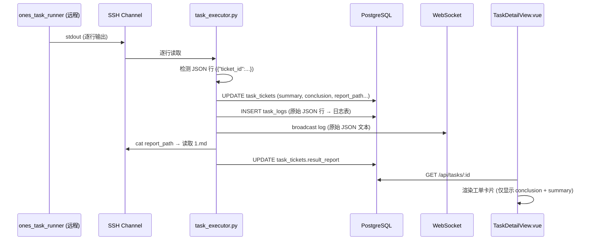
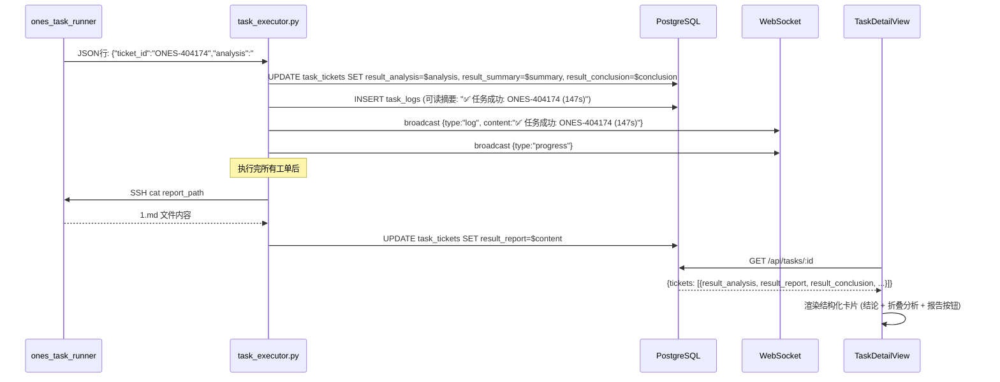

# 任务详情展示增强 + 用户统计图表 — 技术设计文档

> **版本**: 1.1.0  
> **日期**: 2026-03-18  
> **状态**: 待审阅  
> **关联需求**: [requirements.md](file:///f:/Ones-AI专项开发/.kiro/specs/task-detail-enhance/requirements.md) FR-018 ~ FR-022  
> **关联任务**: [tasks.md](file:///f:/Ones-AI专项开发/.kiro/specs/task-detail-enhance/tasks.md)

---

## 1. 系统概览

### 1.1 当前数据流



### 1.2 问题根因

| 问题 | 根因 |
|------|------|
| 日志显示 JSON 大文本 | `task_executor.py` L252-257: JSON 结果行也作为 `stdout` 日志保存和广播 |
| analysis 未独立存储 | `task_executor.py` L227-231: `analysis` 被追加到 `summary` 中混合存储 |
| 前端无法展示分析内容 | `TaskDetailView.vue` 只渲染 `result_summary` 和 `result_conclusion`，没有 `result_analysis` 字段 |
| 报告路径未展示 | `report_path` 字段虽然存在于数据库，但前端未使用 |

---

## 2. 数据库变更

### 2.1 新增列

```sql
-- database.py MIGRATION_SQL 中追加
ALTER TABLE task_tickets ADD COLUMN IF NOT EXISTS result_analysis TEXT DEFAULT '';
```

### 2.2 字段定义（最终态）

| 列名 | 类型 | 来源 | 用途 |
|------|------|------|------|
| `result_summary` | TEXT | runner JSON `.summary` | 一行摘要，如"工单已处理完成。" |
| `result_conclusion` | TEXT | runner JSON `.conclusion` | 结论句，如"工单 ONES-404174 已经处理完成。" |
| `result_analysis` | TEXT | runner JSON `.analysis` | **新增**。完整 AI 分析内容（Markdown，含表格、代码块等） |
| `result_report` | TEXT | 远程 SSH cat 1.md | 完整报告文件内容（通过 `_download_reports` 下载） |
| `report_path` | TEXT | runner JSON `.report_path` | 远程服务器上的报告文件路径 |

---

## 3. 后端变更

### 3.1 task_executor.py — 结果解析逻辑

**文件**: [task_executor.py](file:///f:/Ones-AI专项开发/ones-ai-platform/backend/task_executor.py)

#### 变更 1: 独立存储 analysis（L213-257）

```diff
 # 解析 JSON 输出（工单结果）
 if line.startswith("{") and '"ticket_id"' in line:
     try:
         result = json.loads(line)
         ticket_id_str = result.get("ticket_id", "")
         ticket_status = result.get("status", "failed")
         duration = result.get("duration", 0)
         summary = result.get("summary", "")
         title = result.get("title", "")
         conclusion = result.get("conclusion", "")
         analysis = result.get("analysis", "")
         report_path = result.get("report_path", "")

-        # 如果有 analysis，追加到 summary
-        if analysis and summary:
-            summary = f"{summary}\n\n{analysis}"
-        elif analysis:
-            summary = analysis
+        # analysis 独立存储到 result_analysis 列，不再混入 summary

         # 更新工单状态（含新字段）
         async with pool.acquire() as conn:
             await conn.execute("""
                 UPDATE task_tickets SET
                     status=$1, result_summary=$2, duration=$3,
                     ticket_title=$4, result_conclusion=$5,
-                    report_path=$6, completed_at=NOW()
-                WHERE task_id=$7 AND ticket_id=$8
+                    report_path=$6, result_analysis=$7,
+                    completed_at=NOW()
+                WHERE task_id=$8 AND ticket_id=$9
             """, "completed" if ticket_status == "success" else "failed",
-                summary, duration, title, conclusion,
-                report_path, task_id, ticket_id_str)
+                summary, duration, title, conclusion,
+                report_path, analysis, task_id, ticket_id_str)
```

#### 变更 2: JSON 行不进入日志流（L252-257）

```diff
-            # 保存和广播日志
-            await _save_log(task_id, line, "stdout")
-            await _broadcast_log(task_id, {
-                "type": "log", "content": line,
-                "timestamp": datetime.now(timezone.utc).isoformat(),
-            })
+            # JSON 结果行已结构化存入 task_tickets，日志中写可读摘要
+            status_emoji = "✅" if ticket_status == "success" else "❌"
+            readable_summary = f"{status_emoji} 任务{ticket_status}: {ticket_id_str} (耗时 {duration:.1f}s)"
+            await _save_log(task_id, readable_summary, "system")
+            await _broadcast_log(task_id, {
+                "type": "log", "content": readable_summary,
+                "log_type": "system",
+                "timestamp": datetime.now(timezone.utc).isoformat(),
+            })
+            # 广播进度更新（触发前端刷新工单结果）
+            await _broadcast_log(task_id, {
+                "type": "progress",
+                "timestamp": datetime.now(timezone.utc).isoformat(),
+            })
+            continue  # 跳过后面的通用日志保存
```

注意：在 JSON 结果行的 `try` 块末尾添加 `continue`，避免该行再进入通用日志保存逻辑。

### 3.2 tasks.py — API 响应扩展

**文件**: [tasks.py](file:///f:/Ones-AI专项开发/ones-ai-platform/backend/tasks.py)

#### 变更: TicketResult 模型新增字段

```diff
 class TicketResult(BaseModel):
     id: int
     ticket_id: str
     note: str
     code_directory: str
     status: str
     result_summary: str
     result_report: str
+    result_analysis: str = ""
     error_message: str
     ticket_title: str = ""
     result_conclusion: str = ""
     report_path: str = ""
     duration: float
     seq_order: int
     evaluation: Optional[dict] = None
```

#### 变更: get_task() 结果映射

```diff
 ticket_results.append(TicketResult(
     id=t["id"], ticket_id=t["ticket_id"], note=t["note"] or "",
     code_directory=t["code_directory"] or "", status=t["status"],
     result_summary=t["result_summary"] or "", result_report=t["result_report"] or "",
+    result_analysis=t["result_analysis"] if "result_analysis" in t.keys() else "",
     error_message=t["error_message"] or "",
     ...
 ))
```

### 3.3 database.py — 迁移 SQL

**文件**: [database.py](file:///f:/Ones-AI专项开发/ones-ai-platform/backend/database.py)

```diff
 MIGRATION_SQL = """
 ALTER TABLE task_tickets ADD COLUMN IF NOT EXISTS ticket_title TEXT DEFAULT '';
 ALTER TABLE task_tickets ADD COLUMN IF NOT EXISTS result_conclusion TEXT DEFAULT '';
 ALTER TABLE task_tickets ADD COLUMN IF NOT EXISTS report_path TEXT DEFAULT '';
+ALTER TABLE task_tickets ADD COLUMN IF NOT EXISTS result_analysis TEXT DEFAULT '';
 """
```

---

## 4. 前端变更

### 4.1 TaskDetailView.vue — 工单结果卡片重新设计

**文件**: [TaskDetailView.vue](file:///f:/Ones-AI专项开发/ones-ai-platform/frontend/src/views/TaskDetailView.vue)

#### 设计原则

- **分层展示**: 信息按重要性分层——头部摘要 > 结论 > 分析详情 > 完整报告
- **渐进披露**: 默认折叠详细内容，点击展开
- **视觉分区**: 不同信息区域使用不同背景色和边框样式

#### 卡片结构

```
┌──────────────────────────────────────────────────────────────┐
│ 头部: ONES-404174  [已完成]  147s              ✅ 已通过    │
├──────────────────────────────────────────────────────────────┤
│ 🤖 AI 结论: 工单 ONES-404174 已经处理完成。                  │
├──────────────────────────────────────────────────────────────┤
│ ▶ 处理详情（点击展开）                                       │
│   ┌───────────────────────────────────────────────────────┐  │
│   │ ## 任务完成报告                                        │  │
│   │ **工单 ONES-404174** 已处理完成。                      │  │
│   │ ### 工单状态                                           │  │
│   │ - 状态: Done                                          │  │
│   │ ### 修改内容确认                                       │  │
│   │ | 文件 | 状态 | 说明 |                                 │  │
│   │ |------|------|------|                                 │  │
│   │ | hdcp_tx22_provision.sh | ✅ | HDCP TX 2.2 ... |     │  │
│   │ ### 技术方案                                           │  │
│   │ 1. 系统启动完成后检查属性...                            │  │
│   │ ### 验证命令                                           │  │
│   │ ```bash                                               │  │
│   │ tee_provision -q -t 0x32                              │  │
│   │ ```                                                   │  │
│   └───────────────────────────────────────────────────────┘  │
├──────────────────────────────────────────────────────────────┤
│ 📄 查看详细报告    ⚠️ 报告路径: workspace/doc/.../1.md       │
└──────────────────────────────────────────────────────────────┘
```

#### 关键实现

1. **处理详情折叠区**: 使用 `v-if` + `t._showAnalysis` 状态控制展开/折叠
2. **Markdown 渲染**: 复用现有 `renderMd()` 函数（基于 `marked.js`）
3. **报告路径提示**: 当 `result_report` 为空但 `report_path` 有值时显示提示

#### 样式设计

| 区域 | 背景色 | 边框 | 说明 |
|------|--------|------|------|
| AI 结论条 | `rgba(99,102,241,0.08)` | 左侧 3px 紫色 | 现有样式保留 |
| 处理详情区 | `var(--bg-surface)` | 1px `var(--border)` | 新增，类似代码块风格 |
| 详细报告弹窗 | 对话框 | - | 复用现有 `el-dialog` |

---

## 5. 组件交互序列

### 5.1 任务完成后的数据流（改进后）



---

## 5.5 用户统计图表

### 5.5.1 后端 — admin.py 新增用户趋势 API

> 关联: [FR-022] → 复用全局趋势 API 的 SQL 模式

**文件**: [admin.py](file:///f:/Ones-AI专项开发/ones-ai-platform/backend/admin.py)

#### 新增 API: `GET /api/admin/users/{user_id}/trends`

```python
@router.get("/users/{user_id}/trends")
async def get_user_trends(
    user_id: int,
    days: int = Query(90, ge=1, le=365),
    granularity: str = Query("day"),
    admin: UserInfo = Depends(require_admin),
):
    """用户使用频次趋势 [FR-022]"""
    pool = await get_pool()
    async with pool.acquire() as conn:
        trunc = {"week": "week", "month": "month"}.get(granularity, "day")
        rows = await conn.fetch(f"""
            SELECT
                DATE_TRUNC('{trunc}', created_at)::DATE as dt,
                COUNT(*) as task_count,
                COALESCE(SUM(ticket_count), 0) as ticket_count
            FROM tasks
            WHERE user_id=$1
              AND created_at >= NOW() - ($2 || ' days')::INTERVAL
              AND status IN ('completed', 'failed')
            GROUP BY dt
            ORDER BY dt
        """, user_id, str(days))

    return [
        {"date": str(r["dt"]), "task_count": r["task_count"], "ticket_count": r["ticket_count"]}
        for r in rows
    ]
```

#### 前端 API 层新增

```javascript
// api/index.js 新增
getUserTrends: (userId, days, granularity) => 
    api.get(`/admin/users/${userId}/trends`, { params: { days, granularity } }),
```

### 5.5.2 前端 — AdminUserDetail.vue 增强

**文件**: [AdminUserDetail.vue](file:///f:/Ones-AI专项开发/ones-ai-platform/frontend/src/views/AdminUserDetail.vue)

当前状态：仅 37 行的纯任务列表。改造为上部图表 + 下部列表的布局。

#### 页面结构

```
┌────────────────────────────────────────────────────────────────┐
│ ← 返回   用户使用记录: yixiang.huang@lango-tech.cn            │
├────────────────────────────────────────────────────────────────┤
│ [按日] [按周] [按月]    近30天 | 近90天 | 近180天              │
├────────────────────────────────────────────────────────────────┤
│ ┌────────────────────────────────────────────────────────────┐ │
│ │         ECharts 使用频次趋势图表 (400px)                   │ │
│ │  ┃  ╭─╮                                  ╭─╮              │ │
│ │  ┃  │ │     ╭─╮                          │ │              │ │
│ │  ┃──│ │──╭──│ │──╭──╮──╭──────╮──╭──╮──│ │──→           │ │
│ │  ┃  │ │  │  │ │  │  │  │      │  │  │  │ │              │ │
│ │  ┗━━╰─╯━━╰━━╰─╯━━╰━━╯━━╰━━━━━━╯━━╰━━╯━━╰─╯━━━          │ │
│ │     3/1  3/4  3/7  3/10 3/13  3/16                        │ │
│ │  ■ 任务数 (折线)   ■ 工单数 (柱状)                          │ │
│ └────────────────────────────────────────────────────────────┘ │
├────────────────────────────────────────────────────────────────┤
│ 📋 任务历史记录                                                │
│ ┌──────────────────────────────────────────────────────────┐   │
│ │ #5 · 编译服务器-1.38   [completed]  1工单 · 147s         │   │
│ │   ONES-404174  补充说明...   [completed]                  │   │
│ └──────────────────────────────────────────────────────────┘   │
└────────────────────────────────────────────────────────────────┘
```

#### ECharts 配置

复用 `AdminTrend.vue` 的图表样式（暗色主题、透明背景、紫色色系），具体配置：

```javascript
chart.setOption({
    backgroundColor: 'transparent',
    tooltip: { trigger: 'axis' },
    legend: { data: ['任务数', '工单数'] },
    grid: { left: 40, right: 20, top: 40, bottom: 30 },
    xAxis: { type: 'category', data: dates },
    yAxis: { type: 'value' },
    series: [
        { name: '任务数', type: 'line', data: taskCounts, smooth: true,
          lineStyle: { color: '#6366f1' }, 
          areaStyle: { /* 渐变填充 */ } },
        { name: '工单数', type: 'bar', data: ticketCounts,
          itemStyle: { color: 'rgba(139,92,246,0.6)', borderRadius: [4,4,0,0] } },
    ],
})
```

---

## 6. 部署考虑

### 6.1 数据库迁移

- 使用 `ADD COLUMN IF NOT EXISTS` 确保幂等，重复执行不报错
- 新增列默认值为空字符串，不影响现有数据
- 应用启动时自动执行迁移（`init_db()` 中已有此机制）

### 6.2 部署步骤

1. 后端代码更新（`task_executor.py`, `tasks.py`, `database.py`, `admin.py`）
2. 前端代码更新（`TaskDetailView.vue`, `AdminUserDetail.vue`, `api/index.js`）
3. 重新构建 Docker 镜像并部署
4. 服务启动后自动执行数据库迁移
5. 新提交的任务将写入 `result_analysis`；历史任务该字段为空，正常显示
6. 用户统计图表立即可用（基于已有的 tasks 表数据聚合，无需数据迁移）

### 6.3 回退方案

- 新增列操作不可逆，但不影响现有功能
- 如需回退前端展示，恢复对应 Vue 文件即可
- 新增的用户趋势 API 独立，删除不影响其他功能
