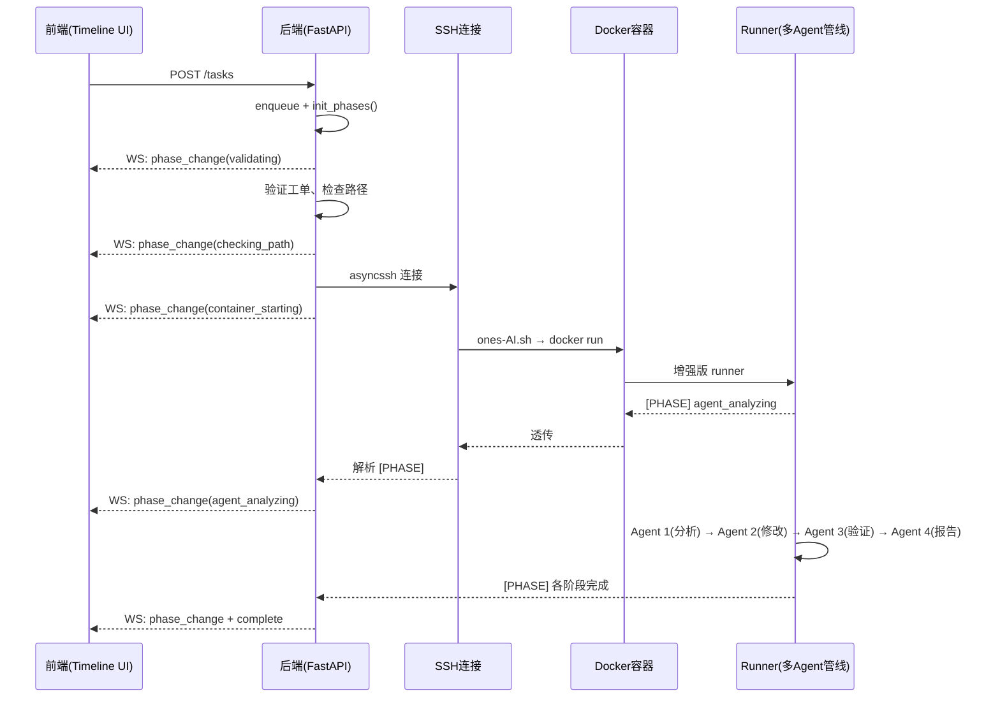
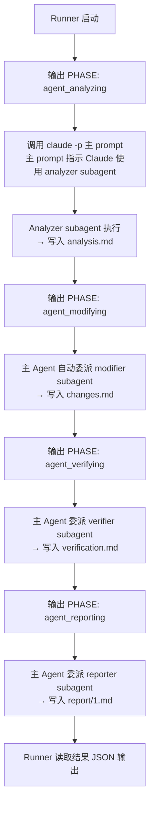

# 任务执行流水线重构 — 技术设计文档（v2）

> **功能名称**: task-execution-pipeline  
> **日期**: 2026-03-26  
> **版本**: v2  
> **状态**: 待审阅

---

## 1. 系统概览

### 1.1 目标执行流



---

## 2. 数据库变更

### 2.1 新增表: `task_ticket_phases`

```sql
CREATE TABLE IF NOT EXISTS task_ticket_phases (
    id SERIAL PRIMARY KEY,
    task_ticket_id INTEGER NOT NULL REFERENCES task_tickets(id) ON DELETE CASCADE,
    phase_name VARCHAR(50) NOT NULL,
    phase_label VARCHAR(100) NOT NULL,
    phase_order INTEGER NOT NULL DEFAULT 0,
    status VARCHAR(20) NOT NULL DEFAULT 'pending',
    message TEXT DEFAULT '',
    started_at TIMESTAMP WITH TIME ZONE,
    completed_at TIMESTAMP WITH TIME ZONE,
    duration_ms INTEGER,
    created_at TIMESTAMP WITH TIME ZONE DEFAULT NOW()
);
CREATE INDEX idx_ttp_ticket ON task_ticket_phases(task_ticket_id);
```

### 2.2 新增表: `user_code_paths`

```sql
CREATE TABLE IF NOT EXISTS user_code_paths (
    id SERIAL PRIMARY KEY,
    user_id INTEGER NOT NULL REFERENCES users(id) ON DELETE CASCADE,
    server_id INTEGER NOT NULL REFERENCES servers(id) ON DELETE CASCADE,
    path VARCHAR(500) NOT NULL,
    use_count INTEGER DEFAULT 1,
    last_used_at TIMESTAMP WITH TIME ZONE DEFAULT NOW(),
    created_at TIMESTAMP WITH TIME ZONE DEFAULT NOW(),
    UNIQUE(user_id, server_id, path)
);
```

### 2.3 现有表变更

```sql
-- task_logs 增加阶段关联
ALTER TABLE task_logs ADD COLUMN IF NOT EXISTS phase_name VARCHAR(50) DEFAULT '';
```

---

## 3. 后端变更

### 3.1 新增模块: `phases.py` [NEW]

- `PIPELINE_PHASES` 预定义阶段列表（8阶段）
- `init_phases(task_ticket_id)` 预写入全部阶段
- `advance_phase(task_ticket_id, phase_name, status, message)` 推进阶段
- `get_phases(task_ticket_id)` 查询阶段

### 3.2 task_executor.py 增强

1. 工单创建时调用 `init_phases()`
2. SSH 连接前后推进前 3 个阶段
3. 解析 stdout 中 `[PHASE]` 标记行
4. **卡死防护增强**:
   - 单工单心跳超时机制（持续 N 分钟无输出 → 强制 kill + 标记 failed）
   - `process.wait()` 加 timeout，超时后 kill 进程
   - 工单完成后检查仍在 running 的阶段，强制标记
   - 提交时去重检查，同一 task_id 不允许重复工单号

### 3.3 WebSocket 协议扩展

新增 `phase_change` 消息 + 连接时推送历史 phase 数据

### 3.4 新增 API

| 端点 | 说明 |
|------|------|
| `GET /tasks/:id/tickets/:tid/phases` | 查询阶段列表 |
| `PUT /tasks/:id/tickets/:tid` | 编辑排队工单 |
| `GET /users/me/code-paths?server_id=X` | 获取历史代码路径 |
| `DELETE /users/me/code-paths/:id` | 删除历史路径 |
| `POST /tasks/preview` | AI 预分析工单（讨论项） |

### 3.5 AI 预分析 API（讨论项）

```python
@router.post("/tasks/preview")
async def preview_tickets(ticket_ids: list[str]):
    # 1. 调用 ONES API 获取工单标题+描述
    # 2. 构造 prompt 调用轻量 AI 模型
    # 3. 返回推荐提示词
    return [{"ticket_id": tid, "title": "...", "suggested_prompt": "..."}]
```

> [!WARNING]
> **讨论点**: AI 预分析需要额外 API 配额。方案 A: 调用 ONES API 只获取标题/描述（不调 AI，零配额），用户自行判断。方案 B: 调用轻量模型（glm-4.7）生成建议提示词。建议先实现方案 A，作为 v2 迭代再考虑方案 B。

---

## 4. 前端变更

### 4.1 TaskDetailView 重构（参考 GitHub Actions）

```
┌─────────────────────────────────────────────────────┐
│  任务 #42  ·  服务器A  ·  执行中          [状态胶囊]│
├─────────────────────────────────────────────────────┤
│ ┌──────┐ ┌──────┐ ┌──────┐ ┌──────┐                │
│ │ 总数 │ │ 成功 │ │ 失败 │ │ 耗时 │   统计卡片     │
│ └──────┘ └──────┘ └──────┘ └──────┘                │
├──────────────────┬──────────────────────────────────┤
│                  │                                  │
│  ONES-12345 [✅] │  ● 校验工单信息      ✓ 0.5s     │
│  简洁的AI结论    │  │                               │
│                  │  ● 检查代码路径      ✓ 1.2s     │
│  ONES-12346 [🔄] │  │                               │
│  处理中...       │  ◉ AI 分析工单       运行中...   │
│  [编辑✏️]        │  │  "正在获取工单详情..."         │
│                  │  ○ AI 修改代码       待处理      │
│  ONES-12347 [⏳] │  │                               │
│  排队中          │  ○ 结果验证          待处理      │
│  [编辑✏️]        │  │                               │
│                  │  ○ 生成报告          待处理      │
│                  │                                  │
├──────────────────┴──────────────────────────────────┤
│  [展开完整日志] [查看报告]                          │
└─────────────────────────────────────────────────────┘
```

### 4.2 TaskView 重构（任务提交页）

```
┌─────────────────────────────────────────────────────┐
│  ┌─────────────────────────────────────────────┐    │
│  │  📋 创建新任务                               │    │
│  └─────────────────────────────────────────────┘    │
│                                                     │
│  服务器: [▼ 192.168.1.1 - 在线 ✅]                  │
│  凭证:   [▼ root@192.168.1.1]                       │
│                                                     │
│  Agent:  [▼ /home/xxx/Lango-Agent-Teams]            │
│  模式:   [○ fix  ○ analyze  ○ review]               │
│                                                     │
│  ┌─ 工单列表 ──────────────────────────────────┐    │
│  │ ⠿ ONES-12345  [🤖 AI预分析]                 │    │
│  │   代码路径: [▼ /home/xxx/project ▾历史]      │    │
│  │   补充说明: [__________________________]     │    │
│  │                                             │    │
│  │ ⠿ ONES-12346                                │    │
│  │   代码路径: [▼ __________________ ▾历史]      │    │
│  │   补充说明: [__________________________]     │    │
│  │                                             │    │
│  │             ＋ 添加工单                       │    │
│  └─────────────────────────────────────────────┘    │
│                                                     │
│               [ 🚀 提交任务 ]                        │
└─────────────────────────────────────────────────────┘
```

### 4.3 组件清单

| 组件 | 文件 | 说明 |
|------|------|------|
| 阶段时间线 | `PhaseTimeline.vue` [NEW] | 渲染阶段节点 |
| 工单卡片 | `TicketCard.vue` [NEW] | 左侧工单列表项（含编辑） |
| 阶段详情 | `PhaseDetail.vue` [NEW] | 节点展开内容 |
| 路径选择器 | `CodePathSelect.vue` [NEW] | 历史路径下拉+自由输入 |

### 4.4 CSS 扩展

```css
--phase-pending: var(--text-muted);
--phase-active: var(--accent-light);
--phase-completed: var(--success);
--phase-failed: var(--danger);
--phase-skipped: var(--text-muted);
```

### 4.5 动画设计

- **时间线入场**: stagger fadeInUp（60ms 间隔）
- **active 节点**: 圆点呼吸灯 + 边框发光
- **连接线**: CSS `border-left`（完成=实线，未完成=虚线）

---

## 5. Runner 侧改动 — Claude CLI Subagents 架构

### 5.1 架构选型：Subagents

采用 Claude CLI 原生 Subagent 机制实现多 Agent 串行管线。

**Subagent 特性**：
- 每个 subagent 有**独立上下文窗口**，不消耗父 agent 的 token
- 父 agent 只收到 subagent 的**最终输出文本**
- 可为每个 subagent 定义**专属 system prompt**、**模型选择**、**工具白名单**
- 所有 subagent 运行在**同一容器**中，**共享文件系统**
- 上下文传递通过**约定文件路径**实现（如 `workspace/doc/analysis.md`）

### 5.2 Subagent 定义文件

在 `/opt/lango/subagents/` 目录下部署 4 个 `.md` 文件（与用户的 agent-teams 目录完全隔离）：

#### `analyzer.md` — 分析 Agent
```yaml
---
description: "分析 ONES 工单内容，生成问题分析报告"
model: glm-5
tools:
  - Read
  - Bash(curl *)
  - Bash(cat *)
  - Bash(ls *)
---
你是工单分析专家。根据工单信息分析问题根因，输出分析报告到 workspace/doc/{taskId}/analysis.md
```

#### `modifier.md` — 修改 Agent
```yaml
---
description: "根据分析报告修改代码"
model: glm-5
tools:
  - Read
  - Edit
  - Write
  - Bash(git diff *)
  - Bash(grep *)
  - Bash(find *)
---
你是高级开发工程师。读取 workspace/doc/{taskId}/analysis.md，按照分析结论修改代码。
修改完成后输出变更摘要到 workspace/doc/{taskId}/changes.md
```

#### `verifier.md` — 验证 Agent
```yaml
---
description: "验证代码修改结果"
model: glm-4.7
tools:
  - Read
  - Bash(git diff *)
  - Bash(host-run *)
---
你是代码审查员。读取 changes.md，检查修改是否正确，输出验证结果到 workspace/doc/{taskId}/verification.md
```

#### `reporter.md` — 报告 Agent
```yaml
---
description: "汇总分析、修改、验证结果，生成最终报告"
model: glm-4.7
tools:
  - Read
  - Write
---
你是技术文档专家。汇总 analysis.md、changes.md、verification.md，生成最终报告到 workspace/doc/{taskId}/report/1.md
```

### 5.3 执行流程



**关键**：Runner 仍然只调用**一次** `claude -p`，但主 prompt 指导 Claude 依次使用 4 个 subagent 完成任务。Claude CLI 会自动识别 subagent 文件并按需委派。

### 5.4 `[PHASE]` 标记输出

Runner 在调用 claude 前后输出阶段标记：
```
[PHASE] agent_analyzing 开始分析工单
```

Subagent 内部的阶段切换由主 Agent 的 stdout 输出体现，Runner 无需干预。后端通过解析 stdout 中的 `[PHASE]` 行推进时间线。

### 5.5 与用户 agent-teams 的隔离

| 目录 | 用途 | 加载方式 |
|------|------|---------|
| `/opt/lango/subagents/` | 系统级 subagent 定义 | Claude CLI 自动扫描 |
| 用户的 `agent-teams/` | 用户自定义提示词/规范 | Runner 注入到主 prompt |

两者**完全独立**：
- 系统 subagent 定义工作流（怎么做）
- 用户 agent-teams 定义规范（做什么、遵循什么规则）
- 用户 agent-teams 的 `.md` 内容作为"补充规范"注入到每个 subagent 的 prompt 中

### 5.6 Runner 代码改动要点

```python
# ones_task_runner.py 改动示意

def execute(self, task, agent_prompts=""):
    # 构建主 prompt，指导 Claude 使用 subagent 管线
    prompt = f"""
    你需要处理工单 {task['taskId']}。
    请按以下顺序使用 subagent 完成任务：
    1. 使用 analyzer subagent 分析工单
    2. 使用 modifier subagent 修改代码
    3. 使用 verifier subagent 验证结果
    4. 使用 reporter subagent 生成报告
    
    项目规范：
    {agent_prompts}
    """
    
    # 阶段标记输出
    print("[PHASE] agent_analyzing 开始分析工单", flush=True)
    
    # 仍然单次调用，但 Claude 会自动委派 subagent
    result = subprocess.run(
        [self.claude_path, '--permission-mode', 'bypassPermissions',
         '--max-turns', '100',  # 增加轮数以支持多 subagent
         '-p', prompt],
        ...
    )
```

---

## 6. 部署考虑

- 数据库: `CREATE TABLE IF NOT EXISTS` 幂等迁移
- 向后兼容: 历史任务无 phase 数据时以兼容模式展示
- 回退: 前端恢复旧 Vue 文件即可
- Subagent 文件: 部署到 `/opt/lango/subagents/` 目录
- Runner 更新: `docker cp` 新版 `ones_task_runner.py` + 重启容器
