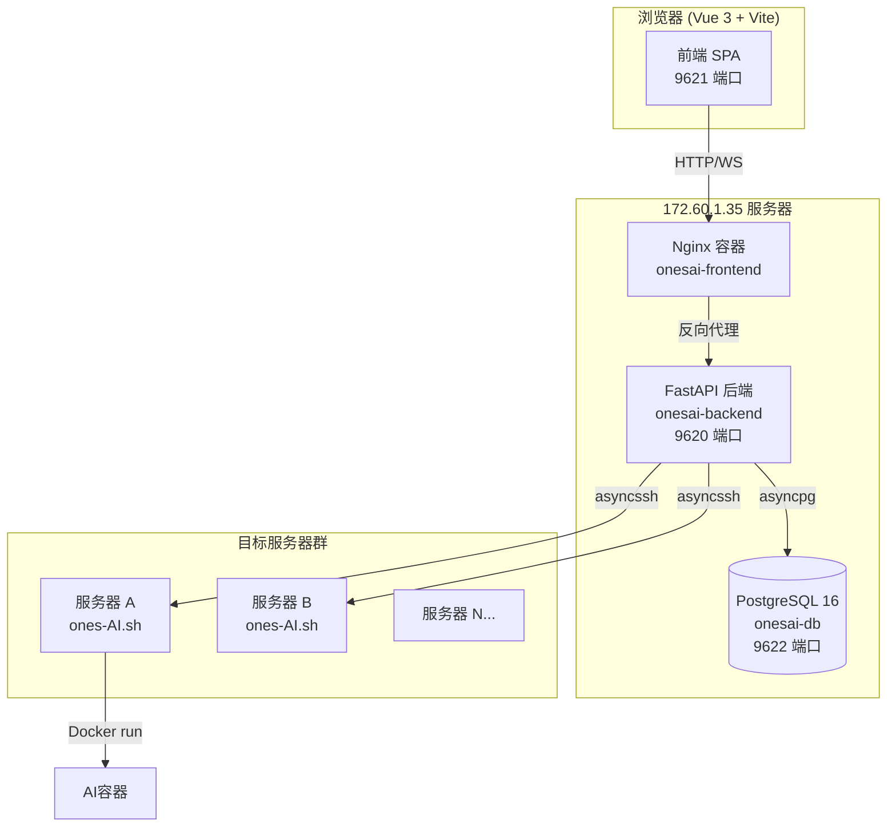
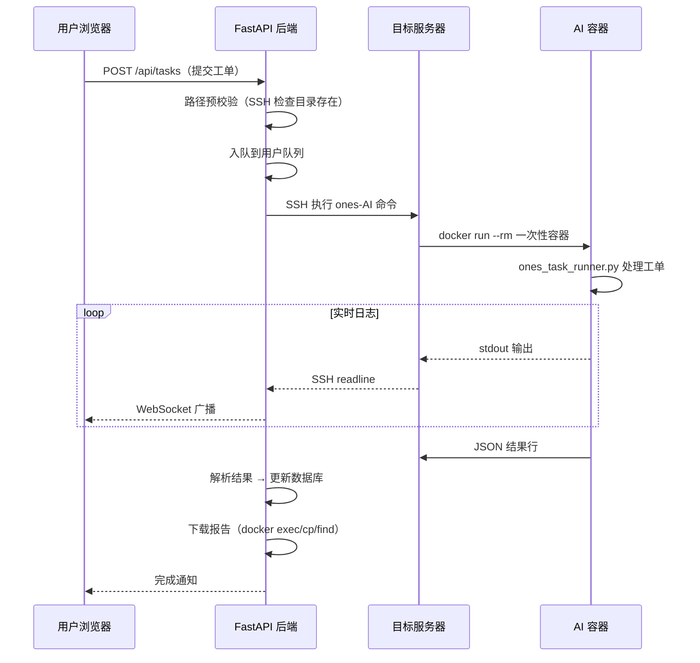
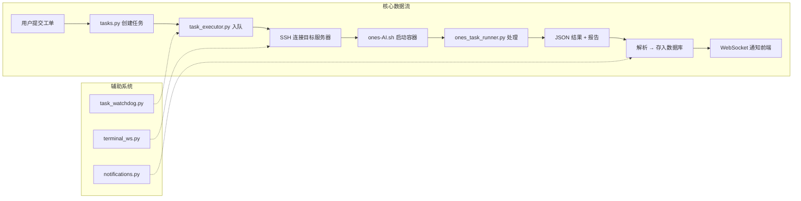

# Ones-AI 平台全貌概览

## 1. 项目定位

Ones-AI 是一个 **ONES 工单自动处理平台**：用户通过 Web 界面提交 ONES 工单号 → 平台通过 SSH 连接到指定服务器 → 在 Docker 容器内执行 AI 代码分析/修复 → 实时推送处理进度 → 返回结构化报告。

---

## 2. 技术架构

| 层级 | 技术栈 | 说明 |
|------|--------|------|
| 前端 | Vue 3 + Vite + Axios + xterm.js | SPA，Nginx 托管 |
| 后端 | Python FastAPI + asyncpg + asyncssh | 异步全栈 |
| 数据库 | PostgreSQL 16 Alpine | Docker 容器部署 |
| 执行器 | ones-AI.sh → Docker 容器 → ones_task_runner.py | 一次性容器执行 |
| AI 模型 | 智谱 GLM-4.7 / GLM-5（通过 Anthropic 兼容 API）| |

---

## 3. 后端模块（9 个路由模块）

| 模块 | 文件 | 职责 |
|------|------|------|
| **认证** | `auth.py` | ONES 邮箱登录 + JWT 鉴权 |
| **服务器管理** | `servers.py` | 服务器 CRUD、SSH 凭证验证/绑定、健康检查、Agent 目录记忆 |
| **任务管理** | `tasks.py` | 创建任务、工单列表、打回重做(rework)、代码路径历史、路径安全校验 |
| **任务执行器** | `task_executor.py` | 核心引擎：用户级队列隔离、SSH 远程 ones-AI 命令、实时日志、多阶段推进、多策略报告下载、SSH 断连重连 |
| **日志流** | `log_streamer.py` | WebSocket 实时日志推送 |
| **阶段管理** | `phases.py` | 工单处理阶段（validating → checking_path → container_starting → agent_analyzing → agent_fixing → reporting） |
| **评价** | `evaluations.py` | 用户对 AI 处理结果的通过/不通过评价 |
| **管理后台** | `admin.py` | 数据概览、趋势图、用户排名、外部服务配置、外部团队管理 |
| **外部 API** | `external.py` | 外部团队日志上报接口 |
| **ONES 预览** | `ones_preview.py` | ONES 工单在线预览 |
| **Web Terminal** | `terminal_ws.py` | SSH PTY 双向代理（自动进入 AI 容器） |
| **通知** | `notifications.py` | 企业微信通知 |
| **看门狗** | `task_watchdog.py` | 后台守护：清理僵尸任务 |

---

## 4. 数据库设计（14 张表）

| 表名 | 用途 |
|------|------|
| `users` | 用户表（ONES 邮箱认证） |
| `servers` | 可用服务器列表 |
| `user_server_credentials` | SSH 凭证（加密存储） |
| `tasks` | 任务记录（一个任务含多个工单） |
| `task_tickets` | 工单明细与执行结果 |
| `task_ticket_phases` | 工单处理阶段记录 |
| `task_evaluations` | 用户评价 |
| `task_logs` | 执行日志 |
| `notification_logs` | 通知发送记录 |
| `external_configs` | 外部服务配置 |
| `user_agent_dirs` | Agent 目录记忆 |
| `user_code_paths` | 代码路径历史 |
| `external_teams` | 外部团队注册 |
| `external_team_members` | 外部团队成员 |
| `external_logs` | 外部日志上报 |

---

## 5. 前端页面（13 个视图 + 4 个组件）

### 视图

| 路由 | 视图 | 功能 |
|------|------|------|
| `/login` | LoginView | ONES 邮箱登录 |
| `/` | DashboardView | 仪表盘（概览统计） |
| `/tasks` | TaskListView | 任务列表 |
| `/tasks/new/:serverId?` | TaskView | 创建任务（选服务器 → 验证凭证 → 填工单号 → 提交） |
| `/tasks/:id` | TaskDetailView | 任务详情（实时日志 + 阶段时间线 + 报告查看 + 评价 + 打回重做） |
| `/admin` | AdminView | 管理后台入口 |
| `/admin/trends` | AdminTrend | 趋势图 |
| `/admin/users` | AdminUsers | 用户管理 |
| `/admin/users/:id` | AdminUserDetail | 用户详情 |
| `/admin/eval` | AdminEval | 评价统计 |
| `/admin/configs` | AdminConfigs | 外部服务配置 |
| `/admin/servers` | AdminServers | 服务器管理 |
| `/admin/external` | AdminExternalTeams | 外部团队管理 |

### 组件

| 组件 | 功能 |
|------|------|
| `CodePathSelect.vue` | 代码路径选择（历史记忆 + 下拉） |
| `PhaseTimeline.vue` | 工单处理阶段时间线 |
| `TicketCard.vue` | 工单卡片展示 |
| `WebTerminal.vue` | xterm.js Web 终端 |

---

## 6. Runner 执行器

### 执行流程

### ones-AI.sh 入口脚本

- 从 Key Gateway（`172.60.1.35:9601`）获取 API Key
- 构建 Docker 容器：挂载 HOME、/opt/lango（只读）、工作目录
- 容器内执行 `ones_task_runner.py`
- 支持交互式/非交互式模式

---

## 7. 172.60.1.35 服务器部署情况

### 容器部署

| 容器名 | 镜像 | 端口 | 用途 |
|--------|------|------|------|
| `onesai-backend` | ones-ai-backend:latest | 9620 → 9625 | FastAPI 后端 |
| `onesai-frontend` | ones-ai-frontend:latest | 9621 → 9626 | Nginx 前端 |
| `onesai-db` | postgres:16-alpine | 9622 → 9627 | PostgreSQL 数据库 |

### 访问地址

- **前端**: `http://172.60.1.35:9621`
- **后端 API**: `http://172.60.1.35:9620`
- **数据库**: `172.60.1.35:9622`（用户: onesai / 密码: onesai123）

### SSH 连接

- **地址**: 172.60.1.35:22
- **用户**: ops
- **部署目录**: `/opt/ones-ai-platform`

---

## 8. 部署流程（/deploy 工作流）

1. **数据库备份** → pg_dump 远程 + 本地双备份
2. **前端构建** → `npm run build` 生成 dist
3. **SFTP 上传** → paramiko 上传修改文件到 35 服务器
4. **前端部署** → `docker cp dist → nginx 容器` + `nginx -s reload`
5. **后端部署** → `docker cp *.py → backend 容器` + `docker restart onesai-backend`
6. **验证** → 检查容器状态 + 数据库完整性 + 前端页面

---

## 9. 一键部署器（Web Deploy Tool）

位置: `ones-ai-platform/_deploy_web_backup/`

| 文件 | 用途 |
|------|------|
| `web_deploy.py` | Flask Web 服务（端口 9680） |
| `deploy_service.py` | 部署核心逻辑（多机批量操作） |
| `index.html` | Web 部署界面 |

支持操作：上传、部署、重新部署、回滚、配置分发、Runner 部署、CLAUDE.md 推送、APP 编译容器部署

---

## 10. 关键依赖关系图

---

## 11. 当前状态与下一步

用户希望着重进入 **"服务器"这个功能**，该功能涉及：

- **后端**: [servers.py](file:///f:/Ones-AI专项开发/ones-ai-platform/backend/servers.py) — 服务器 CRUD、SSH 凭证、健康检查、Agent 目录记忆
- **前端**: [AdminServers.vue](file:///f:/Ones-AI专项开发/ones-ai-platform/frontend/src/views/AdminServers.vue) — 管理员服务器管理页
- **任务创建流程中的服务器选择**: [TaskView.vue](file:///f:/Ones-AI专项开发/ones-ai-platform/frontend/src/views/TaskView.vue)
- **数据库表**: `servers`、`user_server_credentials`、`user_agent_dirs`
