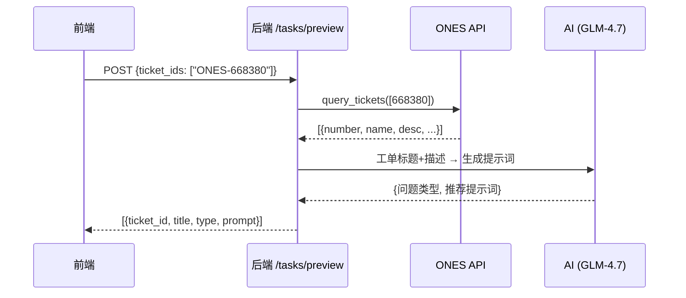

# Task 12-15 实施方案

## Task 13: AI 工单预分析（优先）

### 目标
用户输入工单号后，一键获取 ONES 工单内容并由 AI 自动生成推荐提示词。

### 技术方案



#### 后端

##### [NEW] `ones_preview.py`
- `POST /api/tasks/preview` — 接收工单号列表，返回预分析结果
- 流程：
  1. 解析工单号 → 提取纯数字
  2. 调用 `ones_client.query_tickets()` 获取工单标题+描述
  3. 调用 AI（GLM-4.7 轻量模型）生成提示词建议
  4. 返回结构化结果
- AI Prompt 模板：

```
你是一个代码缺陷分析专家。根据以下 ONES 工单信息，分析问题类型并生成一段简洁的 AI 提示词。

工单号: {ticket_id}
标题: {title}
描述: {description}

请返回 JSON：
{"type": "问题类型(bug/feature/optimization)", "prompt": "推荐提示词(100-200字)"}
```

> [!IMPORTANT]
> AI 调用使用 `AI_BASE_URL` + `AI_SONNET_MODEL`（GLM-4.7 轻量模型），避免消耗 GLM-5 配额。
> 
> 如果 ONES API 不通或 AI 调用失败，返回 `{title: "", prompt: ""}` 空结果，不阻塞用户。

##### [MODIFY] `config.py`
- 新增 `AI_API_KEY` 配置项（已有 `AI_BASE_URL`）

##### [MODIFY] `main.py`
- 注册 `ones_preview.router`

#### 前端

##### [MODIFY] `TaskView.vue`
- 工单号输入框旁新增「🔮 AI 预分析」按钮
- 点击后 loading → 填充工单标题+推荐提示词到 note 字段
- 用户可修改后确认

---

## Task 12: TaskView 提交页 UI 重构

### 变更文件
#### [MODIFY] `TaskView.vue`
- 重构表单布局为现代化卡片式设计
- 代码目录输入替换为 `CodePathSelect` 组件
- 工单输入区增强：支持批量粘贴（逗号/换行分隔自动拆行）
- Agent-Teams 目录下拉选择优化
- 提交按钮+确认弹窗

---

## Task 14: 工单卡死防护

### 变更文件
#### [MODIFY] `task_executor.py`
- 提交时去重检查（同任务内 ticket_id 不得重复）
- runner 未返回 JSON 时强制超时降级

#### [NEW] `task_watchdog.py`
- 全局定时扫描（5 分钟一次）
- 清理运行超过 3 小时的孤立 running 工单
- 清理超过 24 小时的 pending 任务

---

## Task 15: Subagent 管线实现

### 变更文件
#### [NEW] `/opt/lango/subagents/*.md`（4 个定义文件）
- `analyzer.md` — 分析 Agent
- `modifier.md` — 修改 Agent
- `verifier.md` — 验证 Agent
- `reporter.md` — 报告 Agent

#### [MODIFY] `ones_task_runner.py`（容器内）
- 主 prompt 改为 Subagent 委派模式
- 每个 Subagent 输出写入 `workspace/doc/{taskId}/`
- 输出 `[PHASE]` 标记供 executor 解析

---

## 验证计划

### Task 13
1. `curl POST /api/tasks/preview` 验证工单信息获取
2. 前端点击「AI 预分析」按钮，验证提示词自动填充

### Task 12
1. 前端页面视觉对比截图
2. 批量粘贴工单号功能验证

### Task 14
1. 模拟 runner 不返回 JSON，验证超时降级
2. 查询数据库确认无孤立 running 工单

### Task 15
1. SSH 进入容器，手动执行 `claude -p` 验证 subagent 链路
2. WebSocket 接收到 `[PHASE]` 阶段推送
