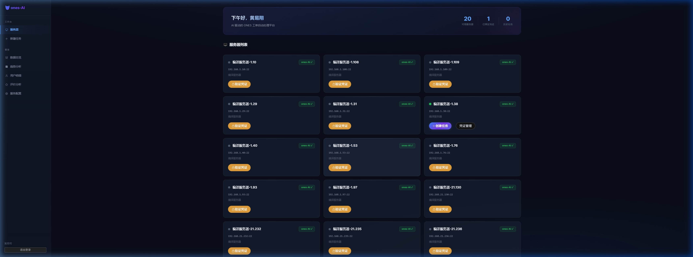
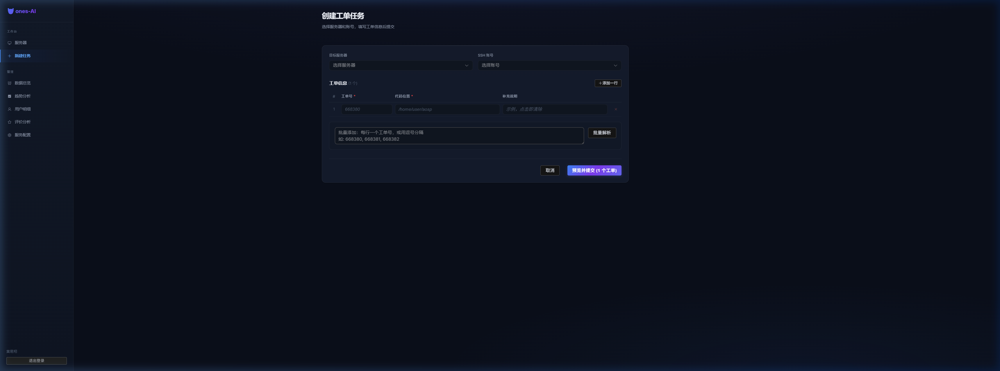
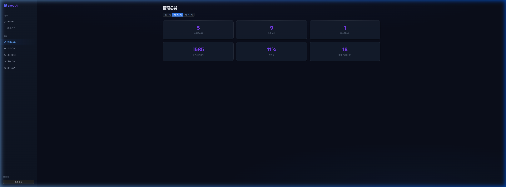
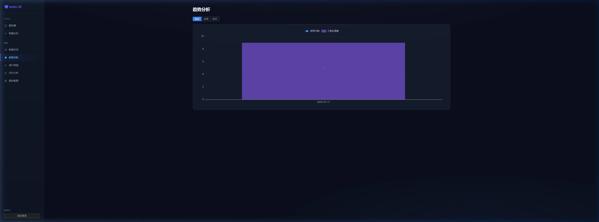
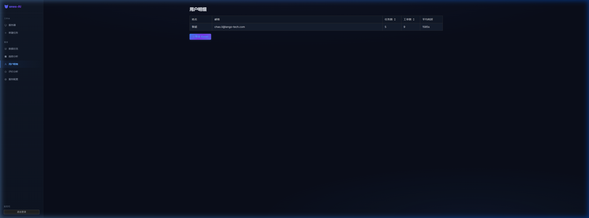
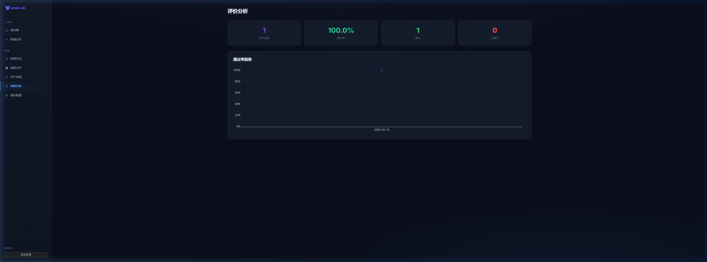
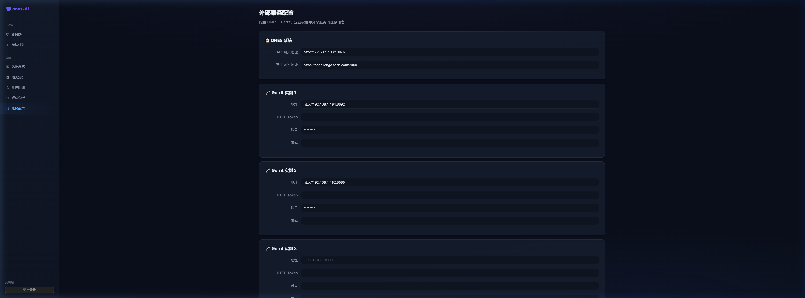

# ones-AI 前端架构说明

更新时间: 2026-03-18 15:13
访问地址: http://172.60.1.35:9621/

## 部署信息

| 项目 | 值 |
|------|-----|
| 前端容器 | `onesai-frontend` (Nginx) |
| 端口 | 9621（外部 → 容器 80） |
| 后端 API | 9620（Nginx 反代 `/api` → 后端 9625） |
| 数据库 | 9627 (PostgreSQL 16) |
| 技术栈 | Vue 3 + Vite + Axios |
| 样式 | 原生 CSS（暗色主题） |
| 认证 | JWT Token + ONES 邮箱密码登录 |

## 目录结构

```
frontend/src/
├── api/index.js          # Axios 封装 + 所有 API 接口
├── router/index.js       # 路由定义（10 个页面）
├── styles/index.css      # 全局样式（暗色主题）
├── views/
│   ├── LoginView.vue          # 登录页
│   ├── DashboardView.vue      # 仪表盘（首页）
│   ├── TaskView.vue           # 创建工单任务
│   ├── TaskDetailView.vue     # 任务详情（实时日志+工单结果）
│   ├── AdminView.vue          # 管理总览
│   ├── AdminTrend.vue         # 趋势分析
│   ├── AdminUsers.vue         # 用户排行
│   ├── AdminUserDetail.vue    # 用户使用明细
│   ├── AdminEval.vue          # 评价分析
│   └── AdminConfigs.vue       # 服务配置（通知开关等）
└── App.vue                    # 根组件（含侧边栏导航）
```

## 页面功能详解

---

### 1. 登录页 (`/login`)


- ONES 邮箱 + 密码登录
- 后端调用 ONES API 验证，成功后签发 JWT
- Token 存 localStorage，请求自动附带 `Authorization: Bearer xxx`

---

### 2. 仪表盘 / 首页 (`/`)



- 欢迎语 + 统计卡片（总任务数、已完成、进行中）
- **服务器列表**：卡片展示所有编译服务器
  - 绿点 = ones-AI 已安装
  - 橙点 = 未确认
  - 按钮：「验证凭证」「创建任务」「凭证管理」
- 验证凭证 = 用户输入 SSH 账号密码，后端 SSH 到该服务器验证

---

### 3. 创建工单任务 (`/tasks/new/:serverId?`)



- **目标服务器**下拉 + **SSH 账号**下拉（从已验证凭证选取）
- **工单信息表格**：
  - 工单号（如 668380）
  - 代码位置（如 `/home/user/aosp`）
  - 补充说明
  - 支持 +添加行 / ×删除行
- **批量解析**：粘贴多个工单号（逗号或换行分隔），一键解析成多行
- 提交后跳到任务详情页，WebSocket 实时推日志

---

### 4. 任务详情 (`/tasks/:id`)

- 状态标签：执行中/已完成/失败
- 进度条 + 统计（工单数、成功/失败、耗时）
- **执行日志**：WebSocket 实时流（ws://host/ws/tasks/{id}/logs）
- **工单结果**：每个工单卡片显示状态（pending/completed/failed）+ 结论摘要
- 支持查看报告（`/api/tasks/{id}/tickets/{ticket_id}/report`）

---

### 5. 管理总览 (`/admin`) — 需 admin 权限



- 时间筛选：近7天 / 近30天 / 近90天
- 6 个指标卡片：
  - 总使用次数、总工单数、独立用户数
  - 平均耗时(秒)、通过率、预估节省(小时) = 总工单数 × 2

---

### 6. 趋势分析 (`/admin/trends`)



- 按天/周/月维度的任务数和工单数折线图
- API：`GET /admin/trends?days=30&granularity=day`

---

### 7. 用户排行 (`/admin/users`)



- 按任务数排序的用户列表
- 显示：邮箱、姓名、任务数、工单数、平均耗时
- 点击可进入用户使用明细

---

### 8. 评价分析 (`/admin/eval`)



- 评价总数、通过数、未通过数、通过率
- 按天趋势图

---

### 9. 服务配置 (`/admin/configs`)



- 外部服务配置管理（ONES API、Webhook、SMTP 等）
- 加密字段显示为 `********`
- 通知开关：Webhook / Email 各自独立

---

## API 接口一览

| 分类 | 方法 | 路径 | 说明 |
|------|------|------|------|
| **认证** | POST | `/api/auth/login` | ONES 邮箱密码登录 |
| | GET | `/api/auth/me` | 获取当前用户 |
| **服务器** | GET | `/api/servers` | 服务器列表 |
| | POST | `/api/servers/{id}/verify` | 验证 SSH 凭证 |
| | GET | `/api/servers/{id}/credentials` | 获取该服务器凭证 |
| | DELETE | `/api/servers/{id}/credentials/{cid}` | 删除凭证 |
| | POST | `/api/servers` | 添加服务器 |
| | POST | `/api/servers/{id}/health` | 健康检查 |
| **任务** | POST | `/api/tasks` | 创建任务 |
| | GET | `/api/tasks` | 任务列表（分页） |
| | GET | `/api/tasks/{id}` | 任务详情 |
| | DELETE | `/api/tasks/{id}` | 取消任务 |
| | GET | `/api/tasks/{id}/logs` | 任务日志 |
| | GET | `/api/tasks/{id}/tickets/{tid}/report` | 工单报告 |
| **评价** | POST | `/api/evaluations` | 提交评价 |
| **管理** | GET | `/api/admin/overview` | 总览 |
| | GET | `/api/admin/trends` | 趋势 |
| | GET | `/api/admin/users` | 用户排行 |
| | GET | `/api/admin/users/{id}/detail` | 用户明细 |
| | GET | `/api/admin/evaluations/stats` | 评价统计 |
| | GET | `/api/admin/configs` | 获取配置 |
| | POST | `/api/admin/configs` | 更新配置 |
| **实时** | WS | `/ws/tasks/{id}/logs` | WebSocket 日志流 |

## 侧边栏导航

```
ones-AI
├── 工作台
│   ├── 🖥 服务器        → /
│   └── ＋ 创建任务      → /tasks/new
├── 管理
│   ├── 📊 数据总览      → /admin
│   ├── 📈 趋势分析      → /admin/trends
│   ├── 👥 用户明细      → /admin/users
│   ├── ⭐ 评价分析      → /admin/eval
│   └── ⚙ 服务配置      → /admin/configs
└── 退出登录
```

## 登录凭证

- 邮箱：ONES 系统邮箱（如 `yixiang.huang@lango-tech.cn`）
- 密码：ONES 系统密码
- 管理员权限：后端 `users` 表 `role = 'admin'`
